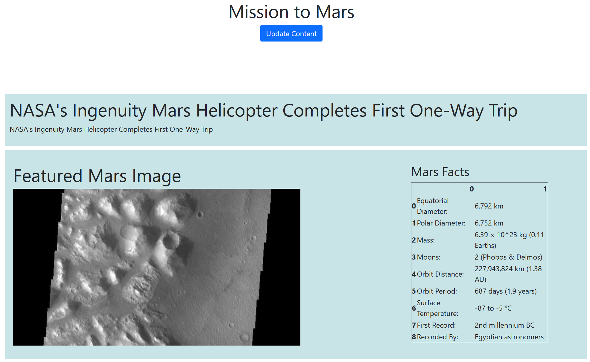

# NASA Mars Webscraping

# Summary
This repository is for the web scraping assignment for the UCSD Data Bootcamp using the Bootstrap website framework. The assignment covers the following concepts:
- Use Beautiful Soup webscraping to retrieve data
- Use Flask to connect scraping scripts to web pages
- Dynamically update content on website while simultaneously adding new data to MongoDB databases using pymongo

*Requires Google Chrome browser for the scraper script to operate

# File Overview

## Missions_to_Mars
-Contains all Python script files, and the HTML and CSS files for the web application

### app.py
- Main Flask application file. Contains a Flask route for the webpage and scraping function respectively.

### scrape_mars.py
- The file to run to operate the application
- Holds definition of scraper function scrape_nasa(). Uses BeautifulSoup and ChromeDriverManager to navigate to the following target pages and retrieve text and image data: 
- Latest News Headline: https://mars.nasa.gov/news/?page=0&per_page=40&order=publish_date+desc%2Ccreated_at+desc&search=&category=19%2C165%2C184%2C204&blank_scope=Latest
- Latest Image URL: https://data-class-jpl-space.s3.amazonaws.com/JPL_Space/index.html
- General Mars Information: https://space-facts.com/mars/
- Images for each Mars Hemisphere: https://astrogeology.usgs.gov/search/results?q=hemisphere+enhanced&k1=target&v1=Mars
 
 The infomration is assembled into a Python dictionary and returned to the Flask object, to be rendered using Jinga.
 
### mission_to_mars.ipynb
- Jupyter Notebook to design scraping code

### templates
- Contains index.html file

### static
- Contains .css files
